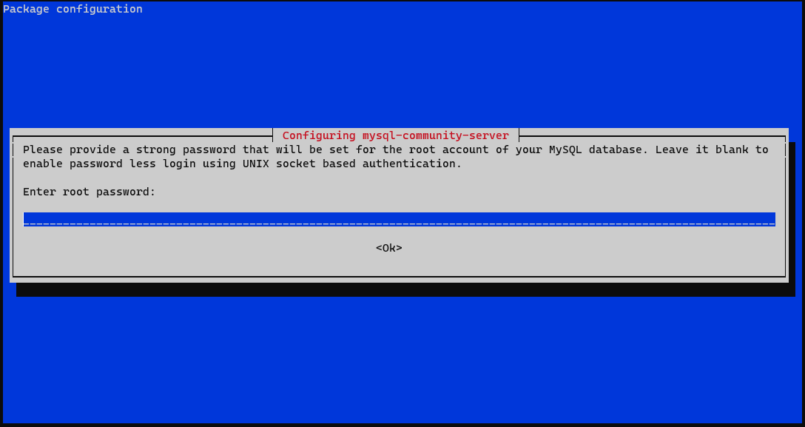

# MySQL #

## 安裝套件 ##

[MySQL :: MySQL Community Downloads](https://dev.mysql.com/downloads/)

### Debian ###

```bash
#從官網下載repository並安裝
apt -y install ./mysql-apt-config_0.8.23-1_all.deb
#更新套件源
apt update
#安裝MySQL Server
apt -y install mysql-server
```

安裝過程會請你設定Root密碼



確認


使用更強的加密


### CentOS ###

```bash
dnf -y install ./mysql80-community-release-el9-1.noarch.rpm
dnf update
dnf -y install mysql-server
```

## 登入MySQL ##

```bash
#登入本地電腦
mysql -D test_db -u root -p 
-D 指定資料庫
-u 指定使用者
-p 密碼
#登入遠端電腦，參數可不必空格
mysql -D test_db -h 123.0.1.1 -u root -p P@ssw0rd 
```

## 修改密碼方式 ##

直接修改

```bash
#顯示Enter password後輸入舊密碼即可
mysqladmin -u user -p password <新密碼>
```

使用mysql_secure_installation

```bash
#輸入後按照步驟填入對應訊息即可
mysql_secure_installation 
```
## 基本操作 ## 

### 顯示狀態 ###

```bash
#顯示狀態
status
#顯示版本
select version()
#查看port號
show global variables like 'port';
```

### 使用者管理 ### 

```bash
#創建帳號test,密碼為P@ssw0rd
create user 'test'@'localhost' identified by 'P@ssw0rd';
#授予所有權限於test_db 
grant all privileges on test_db.* to 'test'@'localhost';
#查看使用者
select user,host from mysql.user;
#查看使用者權限
show grant for 'test'@'localhost';
#移除使用者權限
revoke all privileges, grant option from 'test'@'localhost';
#移除帳號
drop user 'test'@'localhost';

```

### 資料庫管理 ###

```bash
#顯示資料庫列表
show databases;
#創建名為test_db的資料庫，字符編碼為gbk
create database test_db character set gbk; 
#選擇指定的資料庫
use test_db;
#刪除名為test_db的資料庫
drop database test_db;
```

### 資料表管理 ###

```bash
#查看資料表
show tables;
#查看資料表欄位資訊
describe <資料表名稱>
#創建資料表
create table user_account (
    username char(100),
    password text
);
#刪除資料表
drop tables user_account;
#修改資料表欄位
alter table <資料表名稱> change column <原欄位名稱> <要修改的欄位名稱> <資料型態>;
#新增資料表欄位
alter table <資料表名稱> add column <欄位名稱> <資料型態>;
#刪除資料表欄位
alter table <資料表名稱> drop column <欄位名稱>;

```
## TroubleShooting ##

```bash
#ERROR 1045 (28000): Access denied for user 'root'@'localhost' (using password: NO)
#1045可能為密碼錯誤，因安裝完成時，root預設為無密碼，若mysql -uroot -p空密碼無法登入，請使用下列方式修改密碼
#使用vim編輯設定檔
vim /etc/my.cnf
#加入以下
skip-grant-tables 
#重啟服務
systemctl restart mysqld.service
#使用root無密碼登入，出現Enter Password:直接按Enter即可
mysql -uroot -p
#
flush privileges;
#更改密碼，將P@ssw0rd替換為你想更改的密碼
ALTER USER 'root'@'localhost' IDENTIFIED BY 'P@ssw0rd';
```


```bash
#ERROR 1064 (42000): You have an error in your SQL syntax; check the manual that corresponds to your MySQL server version for the right syntax to use near '('Skills39') where user='root'' at line 1

```


```bash
#ERROR 1290 (HY000): The MySQL server is running with the --skip-grant-tables option so it cannot execute this statement

```