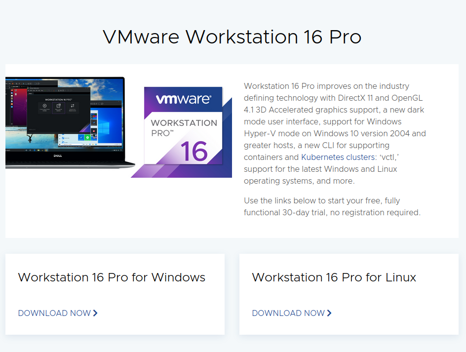

# 安裝VMware workstation

## 安裝步驟 ##

## Debian ##
先到官往下載安裝檔   
[Download VMware Workstation Pro](https://www.vmware.com/products/workstation-pro/workstation-pro-evaluation.html)
    

    
### 安裝GCC
    
```bash
sudo apt -y install gcc build-essential 
```
    
### 執行安裝檔
    
```bash
#進入剛剛下載安裝檔的路徑
cd ~/Download 
#給予執行權限
chmod +x ./VMware-Workstation-Full-16.2.4-20089737.x86_64.bundle
#執行安裝檔
./VMware-Workstation-Full-16.2.4-20089737.x86_64.bundle
```
## Fedora ##
同樣先到官往下載安裝檔   
[Download VMware Workstation Pro](https://www.vmware.com/products/workstation-pro/workstation-pro-evaluation.html)

```bash
dnf install kernel-headers kernel kernel-devel gcc make #安裝核心,gcc,make 
dnf groupinstall "Development tools" #安裝部屬工具
dnf update #更新套件庫
reboot #重新啟動
./VMware-Workstation-Full-16.2.4-20089737.x86_64.bundle #執行下載的檔案
git clone https://github.com/mkubecek/vmware-host-modules #手動安裝模組
cd vmware-host-modules
git checkout workstation-16.2.3
sudo make ; sudo make install
```