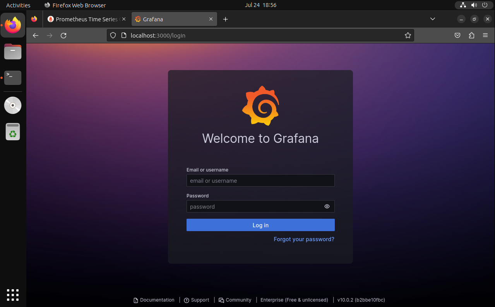

# Grafana #

## 安裝Grafana ##

```bash
wget https://dl.grafana.com/enterprise/release/grafana-enterpries_10.0.2_amd64/deb 
apt -y install ./grafana-enterprise_10.0.2_amd64.deb
```

安裝後開啟服務

```bash
systemctl start grafana #啟動grafana 
systemctl enable grafana #開機自動啟動grafana 
```

啟動後開啟瀏覽器輸入http://localhost:3000，即可看到登入頁面



## 