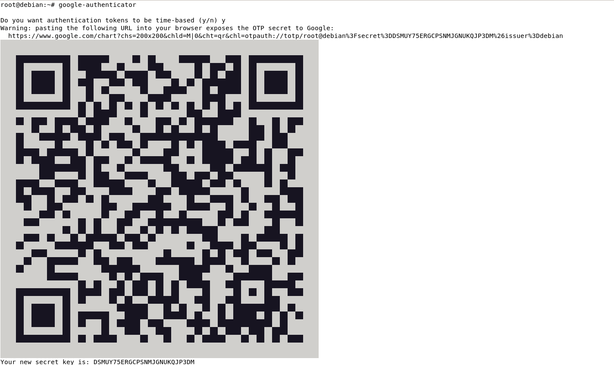
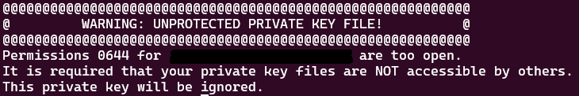

# SSH

## 安裝SSH ##

### Debian ###
```bash
apt -y install openssh-server
```

### CentOS ###
```bash
dnf -y install openssh-server
```

## 編輯設定檔 ##
    
```bash
#先備份一份設定檔，以免設定錯誤無法還原
cp /etc/ssh/sshd_config /etc/ssh/sshd_config.bak 
#使用vim編輯
vim /etc/ssh/sshd_config
#以下內容依實際需要更改
```
    
## 服務管理 ##
    
```bash
#開啟服務
systemctl start sshd
#關閉服務
systemctl stop sshd
#重啟服務
systemctl restart sshd
#開機自動啟動服務
systemctl enable sshd
#開機自動啟動服務並連start一起執行
systemctl enable --now sshd
```
    
## 免密碼登入SSH Server ##
    
### Server ###
    
    開啟SSH服務即可
    
### Client ###

```bash
#建立金鑰，可自行增加參數
ssh-keygen -m PEM -t rsa -b 4096 -N Test
參數:
    -m 金鑰格式
    -t 金鑰類型
    -b 金鑰長度
    -f 檔案存放位置
    -N 存取金鑰的密碼，登入時須輸入
#將公鑰上傳到Server中要登入使用者的家目錄底下，範例為user
#可使用scp,tftp,或者直接複製過去也可以
scp id_rsa.pub user@192.168.1.100:/home/user/.ssh/authorized_keys
#或使用ssh-copy-id(Linux)，使用ssh-copy-id登入要連線的主機
ssh-copy-id user@192.168.1.100
#下次登入就不需要密碼了
```
    
## SSH_Tunnel ##
    
    SSH Tunnel有三種方式 
    
    語法為  假設要綁定Server端的Port 80到本地的Port 8080可以這樣做 Server IP 123.0.1.1 80 local IP 192.168.1.10 
    
    ### Local Port Forwarding
    
    可以用在假如有一台Web Server架設於防火牆之後，防火牆不允許Port 80通過，但允許ssh通過 這時候就可以使用Local Port Forwarding將Server的Port 80綁定給本機對應的Port，連上ssh之後,在本地端開啟瀏覽並輸入網址http://192.168.1.10:8080就可以發現ssh已經將網頁轉送過來了
    
    ### 語法
    
    ```bash
    #ssh -L [本地IP]:[本地Port]:[遠端IP]:[遠端Port] SSH登入帳號@遠端IP
    ssh -L 192.168.1.10:8080:123.0.1.1:80 user@123.0.1.1
    ```
    
    若是SSH Server跟Web Server不是同一台機器，可以這樣做 
    
    ```bash
    #SSH Server IP 123.0.1.1 
    #Web Server IP 123.0.1.2 
    #local IP 192.168.1.10 
    ssh -L 192.168.1.10:8080:123.0.1.2:80 user@123.0.1.1
    ```
    
    這樣同樣可以使用ssh去連接遠端的伺服器做轉發
    
    ### Remote Port Forwarding
    
    ### Dynamic Port Forwarding
    
## SSH防護 ##
## SSH使用2FA ##
        
### 安裝套件 ###
        
```bash
sudo apt install -y libpam-google-authenticator
```
        
### 執行命令 ###
        
```bash
google-authenticator
```
        
執行之後會產生一個QR Code，使用手機掃描並儲存金鑰
        

      

        
```bash
#是否希望驗證tokens是基於時間的
Do you want authentication tokens to be time-based (y/n) y 
#你的金鑰
Your new secret key is: DSMUY75ERGCPSNMJGNUKQJP3DM
#輸入APP上的6位數code 
Enter code from app (-1 to skip): 369975 
#以下為緊急救援碼(避免手機壞掉、無法登入等特殊狀況使用)
Your emergency scratch codes are:
10665727
54601930
22520330
41745341
75424814
#是否要更新身分驗證設定檔
Do you want me to update your "/root/.google_authenticator" file? (y/n) y
#
Do you want to disallow multiple uses of the same authentication
token? This restricts you to one login about every 30s, but it increases your chances to notice or even prevent man-in-the-middle attacks (y/n) y
#禁止同一個身分驗證tokens的多次使用
By default, a new token is generated every 30 seconds by the mobile app.In order to compensate for possible time-skew between the client and the server,we allow an extra token before and after the current time. This allows for a time skew of up to 30 seconds between authentication server and client. If you experience problems with poor time synchronization, you can increase the window from its default size of 3 permitted codes (one previous code, the current code, the next code) to 17 permitted codes (the 8 previous codes, the current code, and the 8 next codes). This will permit for a time skew of up to 4 minutes between client and server. Do you want to do so? (y/n) y
#增加登入限制防止暴力破解，每30秒不可超過3次登入
If the computer that you are logging into isnt hardened against brute-force login attempts, you can enable rate-limiting for the authentication module. By default, this limits attackers to no more than 3 login attempts every 30s. Do you want to enable rate-limiting? (y/n) y
#以上步驟都完成後就可以開始編輯設定檔
```
        
### 編輯設定檔 ###
        
```powershell
#SSH
vim /etc/ssh/sshd_config 
#編輯以下內容
UsePAM yes #關於PAM詳細解說請參考此網址，https://benjr.tw/291
ChallengeResponseAuthentication yes #若是沒有這個，有可能是下面這個
KbdInteractiveAuthentication yes
#PAM
vim /etc/pam.d/sshd
#編輯以下內容，已經有的話就不用更改
@include common-auth 
#Two-Factor authentication via Google Authenticator，可以加入此註解好辨識
auth required pam_google_authenticator.so  
```
        
### 重啟SSH Daemon

```powershell
systemctl restart sshd 
```
        
### 使用SSH 2FA登入
        
輸入密碼以及APP上的驗證碼即可登入
        

        
## knockd ##
         
### 簡介 ###
        
SSH設定port knocking可以更好的對主機進行防護，port knocking用來防止攻擊者進行端口掃描找尋伺服器中可利用的服務，除非攻擊者發送正確的碰撞序列，否則受保護端口將顯示為關閉，碰撞序列為65535個port的組合，一般來說要猜中正確組合不是件容易的事
        
### 安裝套件 ###
        
```bash
apt -y install knockd
```
        
### 編輯設定檔
        
```bash
#使用vim編輯
vim /etc/knockd.conf
#編輯以下內容
[options]
UseSyslog #記錄至系統日誌
LogFile = /var/log/knockd.log #指定日誌路徑
[openSSH] #開啟SSH
sequence    = 7000,8000,9000 #敲門順序，最多可配置7個port
seq_timeout = 5 
#滿足條件後會使用的動作
command     = /sbin/iptables -A INPUT -s %IP -p tcp --dport 22 -j ACCEPT
tcpflags    = syn
[closeSSH] #關閉SSH
sequence    = 9000,8000,7000 
seq_timeout = 5
#滿足條件後會使用的動作
command     = /sbin/iptables -D INPUT -s %IP% -p tcp --dport 22 -j ACCEPT
tcpflags    = syn
```
        
### 開啟knockd ###
        
```bash
#使用vim編輯
vim /etc/default/knockd
#編輯以下內容
START_KNOCKD = 1 #執行knockd
KNOCKD_OPTS = "-i ens33" #將介面更改為自己主機的介面
#使用systemctl開啟服務
systemctl start knockd
```
        
### 用戶端連線 ###
        
需安裝knockd
        
```bash
#開啟
knock 123.0.1.1 7000 8000 9000
#看到以下輸出後使用ssh username@server_ip登入
hitting tcp 192.168.1.1:9000
hitting tcp 192.168.1.1:8000
hitting tcp 192.168.1.1:7000
#關閉
knock 123.0.1.1 9000 8000 7000
```
        
## Fail2Ban ##


## ssh_config ##

    若是要一次連結多台做為跳板，可以編輯ssh_config
   
```bash
Host Host1 #別名
    Hostname 192.168.1.100 #連線主機
    User user #使用者名稱
    Port 22 #端口
    LocalForward 8080 192.168.1.1:80 #SSH Tunnel，命令行的話使用-L
```

## 遠端使用指令但不連入 ##

>ssh還可以在不連線進入主機的狀態下遠端輸入指令

```bash
#例如:
ssh user@123.123.123.123 'ip a' #查看ip
ssh user@123.123.123.123 'cat /proc/cpuinfo' #查看系統資訊
```

## Troubel Shooting ##

### 使用ssh-add xxx時出現錯誤 ###

出現以下錯誤原因是私鑰權限太過寬鬆，更改檔案權限即可



```bash
#預設公鑰權限
chmod 644 xxx.pub
#預設私鑰權限
chmod 600 xxx
```
