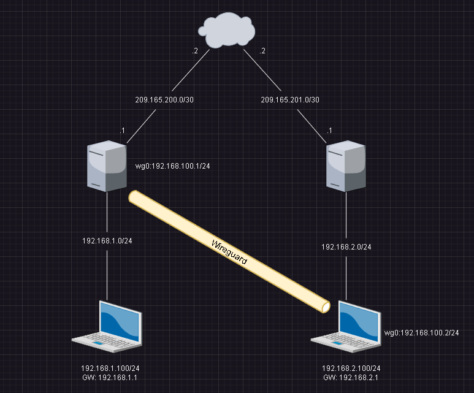
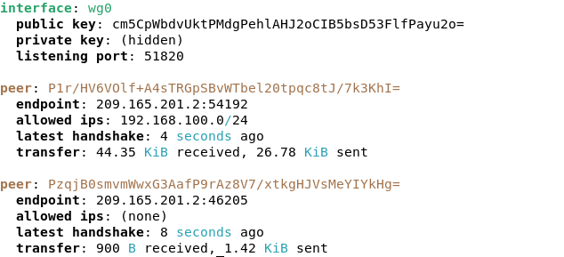

# Wireguard #


## Topology ## 



## 在Client與Server生成金鑰 ##

Server 

```bash
wg genkey | tee /etc/wireguard/server.key #生成私鑰
cat /etc/wireguard/server.key | wg pubkey | tee /etc/wireguard/server.pub #生成公鑰
```

Client 

```bash
wg genkey | tee /etc/wireguard/client.key #生成私鑰
cat /etc/wireguard/client.key | wg pubkey | tee /etc/wireguard/client.pub #生成公鑰
```

## Server ##

```bash
[Interface]
PrivateKey = 貼上剛剛生成的server.key內容
Address = 192.168.100.1/32 #wireguard介面所使用的IP
ListenPort = 51820 #監聽Port 

PostUp = iptables -A FORWARD -i wg0 -j ACCEPT
PostDown = iptables -D FORWARD -i wg0 -j ACCEPT 

[Peer]
PublicKey = 貼上剛剛生成的client.pub內容
AllowedIPs = 0.0.0.0/0
EndPoint = 209.165.200.1:51820 #Server的Public IP

#若是有多個Client就依照上面的Peer更改內容即可
[Peer]
PublicKey = 貼上生成的client.pub內容
AllowedIPs = 0.0.0.0/0
EndPoint = 209.165.200.1:51820 

[Peer]
PublicKey = 貼上生成的client.pub內容
AllowedIPs = 0.0.0.0/0
EndPoint = 209.165.200.1:51820 
```

## Client ##

```bash
[Interface]
PrivateKey = 貼上剛剛生成的client.key內容
Address = 192.168.100.2/32 #wireguard介面所使用的IP

[Peer]
PublicKey = 貼上剛剛生成的server.pub內容
AllowedIPs = 0.0.0.0/0
EndPoint = 209.165.200.1:51820 #Server的Public IP
```

## 開啟wg0 ## 

```bash
wg-quick up wg0 #啟動wg0 
wg-quick down wg0 #關閉wg0 
```

## 查看連線狀況 ##

```bash
wg show 
```

出現下方畫面就代表連線成功(只是舉例，非上方拓樸，請依照實際情況進行觀察)

