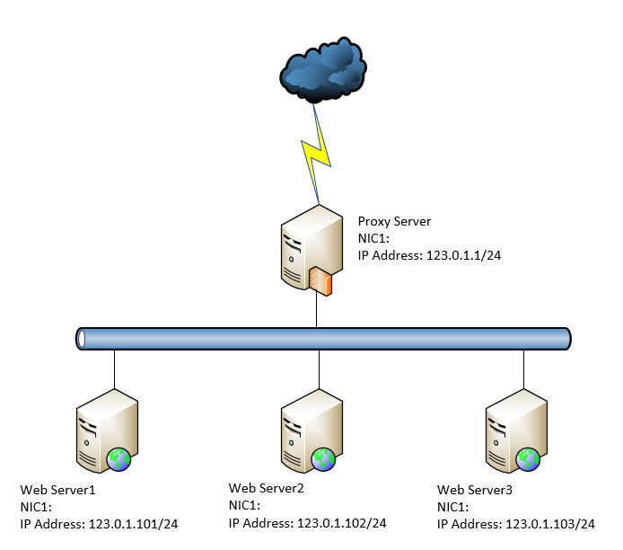

# Reverse Proxy LAB #



## 使用Docker建立LAB環境 ##

Dockerfile

```bash
FROM nginx 
COPY nginx.conf /etc/nginx/nginx.conf 
COPY conf.d /etc/nginx/conf.d
COPY html /usr/share/nginx/html
```

Docker-compose 

```bash
version: '3.7'
services:
  proxy_server:
    images: ""
    ports: 
      - "8800:80"
    networks: 
      - webserver 
  srv1: 
    images: ""
    ports: 
      - "8800:80"
    networks:
      - webserver 
  srv2:
    images: ""
    ports:
      - "8800:80"
    networks:
      - webserver
    
```